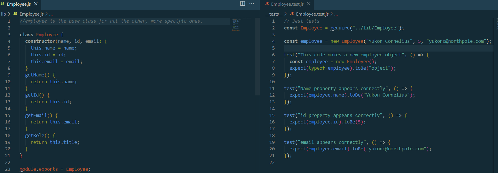

# team-profiler

## Description

Reply to prompts to keep track of your company's team!

## Instructions

Clone or download the repo.

1. Run tests with `npm run test`. Individual tests may be selected by adding the appropriate class name (`Engineer`, `Employee`, `Intern`, `Manager`)
2. Run application by using `node index`.
3. Input your answers to the questions prompted.

## Technologies Used

- Inquirer
- Jest

## Screenshot

## Demonstration Video(s)

https://watch.screencastify.com/v/a0r6MT1dQBABPXcMRcFz